# Part 2: System Architecture

## Project
Collaborative Document Editor with AI Writing Assistant

This document builds on [Part1_Requirements_Engineering.md](../Part1_Requirements_Engineering.md). The architecture follows the C4 model at the System Context, Container, and Component levels, then covers feature breakdown, AI integration, API design, authorization, communication, code structure, data model, and architecture decision records.

Standalone Mermaid sources for every diagram in this document are stored in `architecture/diagrams/`.

## 2.1 C4 Architecture

### 2.1.1 Top Architectural Drivers

The highest-impact drivers from the requirements are:

1. Simultaneous editing with eventual consistency (`FR-COL-01`)
2. Offline editing and resynchronization (`FR-COL-04`)
3. AI invocation from explicit user intent (`FR-AI-01`)
4. Overlapping-edit conflict handling (`FR-COL-03`)
5. Version snapshoting (`FR-DOC-02`)
6. Document creation and metadata initialization (`FR-DOC-01`)
7. Safe revert during active collaboration (`FR-DOC-03`)

These drivers push us toward a real-time editing design with a separate background AI worker, version history that is not changed later, clear permission checks, and stored records about each user or AI action.

### 2.1.2 Level 1 - System Context Diagram

The system context shows the collaborative editor as a single product boundary. The primary external actors are collaborators and workspace administrators. The only external systems that are essential at this level are the identity provider for authentication and the third-party LLM provider used to generate AI suggestions.


This level answers the C4 question "what does the system interact with?" Editing and permission checks stay inside the product, while login and LLM calls stay outside. That is important because those outside services can be slow or unavailable, and the editor should still fail in a controlled way.

### 2.1.3 Level 2 - Container Diagram

The container view breaks the system into the main running parts. The browser client handles the editor UI, local state, offline storage, and AI suggestion display. The API app handles normal backend actions like documents, sharing, versions, and permissions. A separate collaboration service handles live syncing and presence. AI runs in a background worker so a slow AI request does not block typing.



The technology choices are fairly practical. The web client uses TypeScript, TipTap/ProseMirror, and Yjs for rich-text editing and shared editing state. The API and worker also use TypeScript so shared types and validation rules are easier to reuse. Redis handles short-term data like presence, room state, and AI job queues, while PostgreSQL is the main database for users, documents, permissions, versions, AI records, and audit logs.

### 2.1.4 Level 3 - Component Diagram (Collaboration Service)

The collaboration service is the most sensitive part of the architecture because it directly handles simultaneous editing, offline recovery, and predictable handling of overlapping edits. Its internal parts are separated so session handling, merge logic, replay logic, presence, and version checkpoint creation can be changed more easily later.



Two design decisions are important here. First, the merge engine uses a CRDT (Conflict-free Replicated Data Type, a way to merge edits safely) so disconnected clients can keep working and still end up with the same final document. Second, version checkpoint creation is kept outside the merge engine, so saving versions does not slow down the live editing path. That separation matters for `FR-COL-01`, `FR-COL-04`, `FR-COL-03`, and the document versioning requirements.

## 2.2 Architectural Concerns

### 2.2.1 Feature Decomposition (Feature Breakdown)

The system is split into modules that can be built and tested fairly independently.

| Module | What it does | Depends on | Interface exposed to other modules |
|---|---|---|---|
| Rich-text editor and frontend state management | Shows the document, applies local edits right away, stores offline changes in IndexedDB, and shows presence, versions, and AI suggestions. | Shared document structure rules (schema), collaboration session API, AI job API, login/session state. | Editor commands (`applyLocalOp`, `acceptSuggestion`, `revertVersion`), UI state events, document view model. |
| Real-time synchronization layer | Keeps live document rooms running, merges edits from different users, tracks presence, replays missed changes after reconnect, and sends refresh events after a revert. | WebSocket transport, CRDT document model (shared merge model), Redis room state, document snapshots. | Session join/leave, operation stream, presence events, ack/replay rules, refresh notifications. |
| AI assistant service | Receives AI requests, builds prompts, checks role and quota rules, calls the provider, stores saved suggestion results, and sends status updates. | Document content access, prompt templates, LLM adapter, quota policy, audit logging. | `createAiRequest`, `cancelAiRequest`, `getAiStatus`, `applySuggestion`, `rejectSuggestion`. |
| Document storage and versioning | Creates documents, stores metadata, writes saved versions that are not changed later, lists history, restores old states by creating a new head version, and prepares exports. | PostgreSQL metadata, object storage, authorization, collaboration refresh events. | CRUD APIs, version listing, snapshot creation, revert command, export generation. |
| User authentication and authorization | Authenticates users, resolves workspace and document roles, enforces permission matrix for edit/share/AI/revert actions, records privileged operations. | Identity provider integration, membership data, document permissions, AI policy settings. | Session validation, role lookup, access checks, AI feature policy lookup, audit events. |
| API layer connecting frontend and backend | Exposes stable backend interfaces, prepares data for the client, creates collaboration session tokens, and exposes SSE (Server-Sent Events, one-way live updates) for long AI jobs. | Authorization service, document service, versioning service, AI worker flow, audit logging. | REST endpoints, SSE streams, session start data, standard error response format. |

This split matches the traceability matrix in Part 1. The editor and collaboration layer own fast live behavior. The AI assistant and document/versioning parts own slower background work and saved data. The API and auth layers are the main boundary used by the client and by other internal services.

### 2.2.2 AI Integration Design

#### Context and Scope

AI requests are selection-first by default. For rewrite, summarize, and translate, the client sends the selected text plus a small amount of nearby context, such as the document title, heading path, and nearby paragraphs. This keeps cost lower, makes responses faster, and sends less private data to the third-party LLM provider.

For restructure requests, the scope grows from just the selection to the section or document outline, because the local text alone is usually not enough. Very long documents are handled in steps:

- First, build an outline and a meaning-based summary from stored metadata and nearby headings.
- Second, split large text into fixed-size chunks so the prompt size stays predictable.
- Third, keep the base document version and selection hash with the AI request so the result can later be matched back to the current content.

This means the AI may see a little less of the full document, but the trade-off is worth it because cost and response time stay more predictable. That fits this product, since users review suggestions instead of letting the AI rewrite the whole document automatically.

#### Suggestion UX

AI output is shown like tracked changes instead of replacing the text immediately. The UI has three connected views:

- Inline highlights in the editor show exactly which ranges would change.
- A side panel shows the full before/after diff, status, and model metadata.
- Accept, reject, partial-accept, and edit actions let the user stay in control.

Partial acceptance works by applying only the selected parts of the saved suggestion result. Accepted changes become normal document edits, so undo works through the same local history used for human edits. A successful accept can also create a version checkpoint if the change is large enough based on a config setting.

#### AI During Collaboration

The system does not hard-lock text when AI is used. Instead, it stores the request with the base document version and selected range, then shows a small "AI drafting" marker to collaborators looking at the same area.

If other users edit the region while the AI job is running:

- Editing continues normally.
- When the AI result arrives, the client tries to match the suggestion to the current CRDT state (the shared merge state).
- If that match is safe, the user sees an updated proposal against the latest text.
- If the region diverged too much, the UI marks the result as stale and asks the requester to review or regenerate.

This avoids blocking collaboration and keeps the behavior easy to trust. Other collaborators never get a hidden AI overwrite. They only see a suggestion or, after explicit acceptance, a normal document change.

#### Prompt Design

Prompt logic is template-based and versioned. Each feature has:

- A base system instruction
- A feature template (`rewrite`, `summarize`, `translate`, `restructure`)
- Runtime variables such as tone, target language, heading path, and length target
- Output rules (contracts) that tell the model to return structured results, such as patch text and explanation fields

Templates live in shared config instead of being hardcoded in source files, so prompt changes can be rolled out without redeploying every service. The AI worker loads the active prompt versions at startup and can refresh them through a feature flag (config switch) or config update channel.

#### Model and Cost Strategy

Different models are used for different tasks:

- Low-cost, low-latency model for summarize and translate on bounded selections
- Higher-quality model for rewrite and restructure where instruction following matters more
- Optional enterprise option for privacy-sensitive customers that need a different provider

Cost control is checked at both user and workspace level. Each AI request checks:

- Role permission for the requested feature
- Remaining user quota
- Workspace budget ceiling
- Whether the provider is healthy and still within time limits

When a limit is exceeded, the request is rejected before any provider call is made. The user gets a quota-specific error, sees remaining allowance when useful, and can keep using the rest of the editor normally.

### 2.2.3 API Design

#### API Style Choices

The system uses a mix of API styles because the interactions are different:

| Interaction type | Style | Why this fits |
|---|---|---|
| Document CRUD, permissions, version history, exports | REST/JSON over HTTPS | Good for normal data actions, easy to understand, easy to version, and easy to log. |
| Live editing, presence, operation acks, reconnect replay | WebSocket connection (two-way live connection) | Needed because editing is live and both client and server need to send updates quickly. |
| AI job status and progress updates | Server-Sent Events (SSE, one-way live updates from server to client), with polling fallback | Good for long AI jobs where the server mainly needs to push status updates back to the client. |

#### Concrete API Contracts

##### Document CRUD and Versioning

| Method | Endpoint | Purpose | Success responses |
|---|---|---|---|
| `POST` | `/v1/documents` | Create a document with initial metadata and optional template content. | `201 Created` |
| `GET` | `/v1/documents/{documentId}` | Fetch document metadata, the current version reference, and permissions summary. | `200 OK` |
| `PATCH` | `/v1/documents/{documentId}` | Update mutable metadata such as title or status. | `200 OK` |
| `DELETE` | `/v1/documents/{documentId}` | Soft-delete or archive a document. | `204 No Content` |
| `GET` | `/v1/documents/{documentId}/versions` | List saved versions that are not changed later. | `200 OK` |
| `GET` | `/v1/documents/{documentId}/versions/{versionId}` | Fetch version metadata and snapshot link. | `200 OK` |
| `POST` | `/v1/documents/{documentId}/versions/{versionId}:revert` | Create a new head version from a historical version. | `202 Accepted` |
| `POST` | `/v1/documents/{documentId}/exports` | Create an export job with format and AI-trail options. | `202 Accepted` |

Example request for document creation:

```json
{
  "workspaceId": "ws_123",
  "title": "Q3 Product Brief",
  "templateId": null,
  "initialContent": {
    "type": "doc",
    "content": []
  }
}
```

Example response:

```json
{
  "documentId": "doc_456",
  "workspaceId": "ws_123",
  "title": "Q3 Product Brief",
  "ownerRole": "owner",
  "currentVersionId": "ver_001",
  "createdAt": "2026-03-16T11:25:00Z"
}
```

##### Real-Time Session Management

| Method | Endpoint | Purpose | Success responses |
|---|---|---|---|
| `POST` | `/v1/documents/{documentId}/sessions` | Create a collaboration session token and starting data. | `201 Created` |
| `GET` | `/v1/documents/{documentId}/sessions/{sessionId}` | Read session state for reconnect diagnostics. | `200 OK` |
| `DELETE` | `/v1/documents/{documentId}/sessions/{sessionId}` | End the session explicitly. | `204 No Content` |

Example response when starting a live editing session:

```json
{
  "sessionId": "ses_789",
  "wsUrl": "wss://collab.example.com/rooms/doc_456",
  "sessionToken": "signed-short-lived-token",
  "headVersionId": "ver_031",
  "stateVector": "base64-encoded-yjs-state-vector",
  "presence": [
    {
      "userId": "usr_101",
      "displayName": "Nino"
    }
  ],
  "permissions": {
    "role": "editor",
    "canInvokeAi": true,
    "canRevert": false
  }
}
```

WebSocket message format for collaboration:

| Direction | Event | Example payload |
|---|---|---|
| Client -> Server | `client.ops` | `{ "sessionId": "...", "clientSeq": 42, "ops": [...], "baseStateVector": "..." }` |
| Client -> Server | `client.presence` | `{ "sessionId": "...", "cursor": {...}, "selection": {...} }` |
| Server -> Client | `server.ack` | `{ "ackClientSeq": 42, "serverRevision": 311, "stateVector": "..." }` |
| Server -> Client | `server.ops` | `{ "serverRevision": 312, "ops": [...], "authorUserId": "usr_101" }` |
| Server -> Client | `server.reload_required` | `{ "reason": "revert_created_new_head", "newVersionId": "ver_032" }` |
| Server -> Client | `server.presence` | `{ "participants": [...] }` |

##### AI Assistant Invocation

| Method | Endpoint | Purpose | Success responses |
|---|---|---|---|
| `POST` | `/v1/documents/{documentId}/ai-requests` | Create a new AI job from explicit user intent. | `202 Accepted` |
| `GET` | `/v1/ai-requests/{aiRequestId}` | Fetch current job state and result summary. | `200 OK` |
| `GET` | `/v1/ai-requests/{aiRequestId}/events` | SSE stream for AI job status changes. | `200 OK` |
| `POST` | `/v1/ai-requests/{aiRequestId}:cancel` | Cancel a queued or running AI job. | `202 Accepted` |
| `POST` | `/v1/ai-requests/{aiRequestId}/suggestions/{suggestionId}:apply` | Accept all or part of a suggestion. | `200 OK` |
| `POST` | `/v1/ai-requests/{aiRequestId}/suggestions/{suggestionId}:reject` | Reject a suggestion. | `200 OK` |

AI invocation request:

```json
{
  "feature": "summarize",
  "scope": {
    "type": "selection",
    "start": 1220,
    "end": 1674
  },
  "options": {
    "tone": "executive",
    "maxLength": "short",
    "targetLanguage": null
  },
  "baseVersionId": "ver_031"
}
```

Accepted response:

```json
{
  "aiRequestId": "ai_991",
  "status": "queued",
  "statusUrl": "/v1/ai-requests/ai_991",
  "eventsUrl": "/v1/ai-requests/ai_991/events",
  "cancelUrl": "/v1/ai-requests/ai_991:cancel"
}
```

##### User and Permission Management

| Method | Endpoint | Purpose | Success responses |
|---|---|---|---|
| `GET` | `/v1/me` | Fetch current identity, workspace memberships, and effective policies. | `200 OK` |
| `GET` | `/v1/workspaces/{workspaceId}/members` | List members and workspace roles. | `200 OK` |
| `PATCH` | `/v1/workspaces/{workspaceId}/ai-policies` | Update per-role AI feature policy and budget settings. | `200 OK` |
| `GET` | `/v1/documents/{documentId}/permissions` | Read the final document access list (ACL, access control list). | `200 OK` |
| `POST` | `/v1/documents/{documentId}/shares` | Share document with user, team, or link. | `201 Created` |
| `PATCH` | `/v1/documents/{documentId}/shares/{shareId}` | Change permission level or expiry. | `200 OK` |
| `DELETE` | `/v1/documents/{documentId}/shares/{shareId}` | Revoke share. | `204 No Content` |

Share request example:

```json
{
  "principalType": "user",
  "principalId": "usr_777",
  "permissionLevel": "viewer",
  "expiresAt": "2026-04-01T00:00:00Z"
}
```

#### Long-Running AI Operations

The client does not wait for the whole AI result inside one request. The flow is:

1. `POST /v1/documents/{documentId}/ai-requests` returns `202 Accepted`.
2. The client immediately subscribes to `/v1/ai-requests/{aiRequestId}/events`.
3. The worker emits `queued`, `in_progress`, `completed`, `failed`, or `canceled`.
4. On `completed`, the client fetches the saved suggestion result if it was not already included in the event data.

Example SSE status event:

```text
event: ai.status
data: {"aiRequestId":"ai_991","status":"in_progress","progress":"provider_called"}
```

Polling is still available as a backup option if SSE is blocked in a given environment.

#### Error Handling Strategy

All error responses use the same JSON shape:

```json
{
  "error": {
    "code": "AI_QUOTA_EXCEEDED",
    "message": "Monthly AI quota exceeded for this workspace.",
    "retryable": false,
    "requestId": "req_abc123",
    "details": {
      "quotaScope": "workspace",
      "resetsAt": "2026-04-01T00:00:00Z"
    }
  }
}
```

Clients distinguish the major AI states as follows:

| Situation | API behavior | Client interpretation |
|---|---|---|
| AI is slow but still healthy | `202 Accepted` plus SSE events with `queued` or `in_progress` | Show spinner and keep editor usable. |
| AI failed due to provider or internal error | Final status becomes `failed`; `GET /v1/ai-requests/{id}` returns failure reason | Show error banner and allow retry. |
| User exceeded quota or role policy | Immediate `403 Forbidden` or `429 Too Many Requests` with specific error code | Do not create a provider call; show policy/quota message. |

### 2.2.4 Authentication & Authorization

Authentication is required because the system stores private documents, supports sharing, keeps version history, and AI calls cost money. The main user types are workspace admins, document owners, editors, commenters, viewers, and support or audit roles in managed setups.

Role model:

| Role | Main capabilities | Important restrictions |
|---|---|---|
| Owner | Full document control: edit, share, revert versions, delete/archive, export, view AI history. | Cannot bypass workspace-wide compliance rules. |
| Editor | Edit content, accept AI suggestions, use AI features allowed by policy, export, create versions. | Cannot change document ownership or workspace policy. |
| Commenter | Comment, read, and optionally use limited AI features if workspace policy allows suggestion-only use. | Cannot directly change body content or accept AI output that writes to the document unless given more access. |
| Viewer | Read and export if permitted. | Cannot edit, share, revert, or invoke AI. |
| Workspace Admin | Manage memberships, default AI policy, quota budgets, audit visibility. | Is not automatically the owner of every document unless policy gives extra admin access. |

Privacy considerations for third-party LLM use:

- Minimize scope by defaulting to selection-level context.
- Redact configured sensitive patterns before provider calls when workspace policy requires it.
- Require provider agreements that disable model training on customer content by default.
- Encrypt all document and AI metadata in transit and at rest.
- Keep full prompts and responses only for a short support window, then keep only small metadata needed for auditing.

### 2.2.5 Communication Model

The communication model is real-time and push-based for editing, presence, and reconnect recovery. Polling alone would be simpler, but it cannot meet the collaboration latency targets or presence expectations. The trade-off is that the server must track more live connection state, and reconnect logic becomes more complex.

When a user first opens a shared document:

1. The client loads metadata through the API.
2. The client requests a collaboration session ticket.
3. The collaboration service loads the latest saved document state and the active presence list.
4. The editor becomes writable only after the starting sync state is loaded.

When a user loses connectivity:

1. The editor switches to offline mode and continues accepting local edits.
2. Operations are queued locally with client sequence numbers and extra IDs so the same change is not applied twice.
3. Presence is marked stale for other participants after a timeout.
4. On reconnect, the client resends its last acknowledged state vector (summary of its current sync state) and queued operations.
5. The server skips duplicate replayed operations, merges them into the current CRDT state, and sends back any missing remote operations.

This model preserves a strong user experience under intermittent network conditions while avoiding document locks or manual merge flows in normal use.

## 2.3 Code Structure & Repository Organization

### 2.3.1 Repository Strategy

A monorepo is the best fit for this project. The team is likely small to medium-sized, the frontend and backend share types and validation rules, and the live collaboration message format needs to stay consistent. A monorepo still allows separate deployment of `web`, `api`, `collab`, and `ai-worker`.

Using multiple repos would reduce CI scope for each service, but it would make shared message types harder to keep in sync and would likely create duplicate structure definitions. That extra overhead is not worth it for this project.

### 2.3.2 Repository Structure Diagram



### 2.3.3 Directory Layout

Recommended layout:

```text
SWE-midterm/
  apps/
    web/
    api/
    collab/
    ai-worker/
  packages/
    contracts/
    editor-core/
    ui/
    config/
    testkit/
  infrastructure/
    docker/
    terraform/
    monitoring/
  docs/
    architecture/
  tests/
    e2e/
    integration/
    performance/
```

Directory responsibilities:

- `apps/web`: editor shell, routes, collaboration client, AI suggestion UX, offline storage.
- `apps/api`: REST route definitions, controllers, auth middleware, document and sharing services.
- `apps/collab`: WebSocket room server, sync engine integration, replay logic, presence management.
- `apps/ai-worker`: prompt construction, model routing, provider adapters, job handlers.
- `packages/contracts`: shared DTOs (data transfer objects, shared request/response types), event schemas (data structure rules), validation types, permission enums.
- `packages/editor-core`: shared edit operation types, patch formats, diff utilities, document structure helpers.
- `packages/config`: prompt templates, feature flags, environment variable rules, non-secret defaults.

API route definitions live under `apps/api/src/modules/*/routes` or a similar controller structure. Prompt templates live under `packages/config/prompts/`. Collaboration logic lives under `apps/collab/src/rooms`, `apps/collab/src/sync`, and `apps/collab/src/reconnect`.

### 2.3.4 Shared Code

Frontend and backend should share:

- Shared API request and response types
- Permission and role enums
- Document structure rules (schema) and patch model
- Event names and validators (input check rules) for real-time collaboration

The rule is to share types and pure logic, not actual service code. That prevents duplication without making the services depend on each other too much. For example, `packages/contracts` can be imported by all apps, but the collaboration service should not import API controllers or database repositories.

### 2.3.5 Configuration Management

Secrets such as database URLs, object storage credentials, and LLM provider keys do not belong in the repository. The repository stores:

- `.env.example` files with non-secret placeholders
- Environment variable validation
- Secret names or references expected from the deployment environment

Real secret values live in a secret manager or deployment platform environment store. CI should block commits that contain likely secrets, and local development should use separate sandbox credentials with minimum privileges.

### 2.3.6 Testing Structure

Tests live close to the code for unit tests and in top-level folders for cross-service tests:

- Unit tests beside source files for editor commands, prompt builders, permission checks, and diff helpers
- Integration tests in `tests/integration` for API + database, worker + provider stub, and collaboration + Redis flows
- End-to-end tests in `tests/e2e` for document creation, simultaneous editing, AI suggestion acceptance, share permissions, and version revert
- Performance tests in `tests/performance` for propagation latency, reconnect behavior, and high-collaborator load

AI integration should be tested mostly with provider stubs and recorded fixtures, not live provider calls. A small set of scheduled smoke tests can call the real provider to catch provider API changes without making every CI run expensive or flaky.

## 2.4 Data Model

### 2.4.1 Entity-Relationship Diagram



### 2.4.2 Data Model Notes

Document representation:

- `DOCUMENT` stores the document ID, owner, metadata, and a reference to the latest saved snapshot of the current document head.
- The latest content is stored in a ready-to-load form for fast opening, while older saved versions live in `DOCUMENT_VERSION`.
- Content itself can be stored as a ProseMirror JSON snapshot or a CRDT-serialized blob (saved merge-friendly document state) referenced by `head_storage_key`.

Versioning:

- Each saved checkpoint or major apply action creates a `DOCUMENT_VERSION`.
- Version history is append-only (old rows are not overwritten).
- Revert never deletes history; it creates a new version whose `based_on_version_id` points at the chosen historical version and sets `is_revert = true`.

AI interaction history:

- `AI_REQUEST` records who invoked the feature, on what document, against which base version, with which scope and model.
- `AI_SUGGESTION` stores the returned patch result and final state.
- `SUGGESTION_ACTION` records accept, reject, or partial-accept decisions, including accepted ranges for audit history.

Permissions and sharing:

- `DOCUMENT_PERMISSION` models explicit shares to users or teams.
- `SHARE_LINK` models link-based access with separate expiry and usage controls.
- Workspace membership gives the base access level, while document-level permissions further narrow or expand actual access.

## 2.5 Architecture Decision Records (ADRs)

### ADR-01

**Title**  
Use CRDT-based collaboration (merge method for shared editing) with client-side offline buffering

**Status**  
Accepted

**Context**  
The system must support simultaneous editing, offline work, reconnect replay, and predictable handling of overlapping edits. A central locking model would hurt latency and availability.

**Decision**  
Use a CRDT-based collaboration model with local-first editing in the browser, short-lived room state in the collaboration service, and reconnect replay using client sequence numbers and state vectors (sync summaries).

**Consequences**  
Positive: very good offline behavior, users usually end up with the same final document without manual merging, and there is lower risk of data loss during short disconnects.  
Negative: messages can be larger than simple text diffs, debugging is harder, and snapshot cleanup needs more care.

**Alternatives considered**  
Operational Transform (another shared editing merge approach) with a central sequencing server was rejected because reconnect and offline behavior are harder to reason about and depend more on the server always keeping perfect order. Polling-based synchronization was rejected because it cannot meet the collaboration latency target.

### ADR-02

**Title**  
Treat AI output as async suggestions instead of direct document edits

**Status**  
Accepted

**Context**  
AI is a core feature, but the requirements say users must stay in control, be able to partially accept changes, cancel requests, review history, and keep collaborating without being blocked.

**Decision**  
AI requests are created asynchronously, stored as `AI_REQUEST` records, and turned into saved suggestions that users can accept, reject, or partially apply to the document.

**Consequences**  
Positive: easier for users to trust, supports review and audit, allows long AI jobs without blocking editing, and handles concurrent edits more safely.  
Negative: more state to manage, more UI complexity, and extra storage for saved suggestions.

**Alternatives considered**  
Synchronous inline replacement was rejected because it hides model latency inside the main editing flow and makes failures harder to handle. A chat-style assistant separate from the document model was rejected because it would not satisfy the tracked-diff and partial-accept requirements.

### ADR-03

**Title**  
Use saved versions that are not changed later, and make revert create a new head version

**Status**  
Accepted

**Context**  
The product must support version history, safe revert during active collaboration, and a clear audit trail. Reverting by overwriting the current state would destroy history and confuse collaborators.

**Decision**  
Store document versions as saved records that are not changed later. A revert creates a new head version from a selected older snapshot and sends a refresh event to active collaborators.

**Consequences**  
Positive: full audit trail, easier-to-understand history, safer concurrent collaboration, and support for AI history export.  
Negative: higher storage cost, need for snapshot retention rules, and a more visible refresh event when a revert happens during active editing.

**Alternatives considered**  
In-place rollback was rejected because it breaks history and audit expectations. Pure event sourcing (rebuilding state from a long event log) without periodic snapshots was rejected because document load and restore cost would grow too much for large, long-lived documents.

### ADR-04

**Title**  
Use REST for normal data actions, WebSocket for collaboration, and SSE for AI job status

**Status**  
Accepted

**Context**  
The system has three different kinds of interaction: normal CRUD data actions, low-latency two-way collaboration, and long AI progress updates from server to client. One protocol does not fit all three well.

**Decision**  
Use REST/JSON for documents, permissions, and versions; WebSocket sessions (two-way live connections) for live edits and presence; and SSE for AI status updates with polling as backup.

**Consequences**  
Positive: each interaction uses a protocol that fits it well, client behavior is easier to predict, and AI progress stays visible without overloading the collaboration channel.  
Negative: using multiple protocols makes implementation and monitoring more complex, and client code must support more than one transport.

**Alternatives considered**  
Polling-only APIs were rejected because they cannot deliver live collaboration. WebSocket-only APIs were rejected because normal CRUD and job queries become harder to cache, secure, and debug. GraphQL subscriptions everywhere were rejected because they add complexity without a clear benefit for this assignment's required flows.
